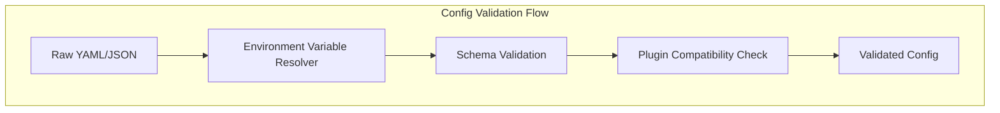

# ASCEND Configuration and Plugin System Design

## 配置系统设计

### 配置格式标准

ASCEND使用YAML作为主要配置格式，支持JSON作为备选。配置分为多个层次：

```yaml
# ascend_config.yaml
version: "1.0.0"

# 1. 智能体配置
agent:
  type: "ppo_agent"  # 插件名称
  config:
    learning_rate: 0.0003
    batch_size: 64
    n_steps: 2048
    ent_coef: 0.01
    vf_coef: 0.5

# 2. 环境配置
environment:
  type: "cartpole_env"
  config:
    max_steps: 500
    render_mode: "human"

# 3. 模型配置
models:
  llm:
    type: "openai_gpt4"
    config:
      api_key: "${OPENAI_API_KEY}"
      model: "gpt-4"
      temperature: 0.7
  
  vision:
    type: "clip_model"
    config:
      model_name: "openai/clip-vit-base-patch32"

# 4. 奖励函数配置
rewards:
  main:
    type: "composite_reward"
    components:
      - type: "task_completion"
        weight: 0.6
        config:
          goal: "solve_puzzle"
      
      - type: "efficiency"
        weight: 0.3
        config:
          time_penalty: 0.01
      
      - type: "safety"
        weight: 0.1
        config:
          max_risk: 0.1

# 5. 特征提取配置
features:
  state_extractor:
    type: "mlp_extractor"
    config:
      hidden_sizes: [64, 64]
      activation: "relu"
  
  action_extractor:
    type: "discrete_extractor"
    config:
      num_actions: 4

# 6. 训练配置
training:
  total_timesteps: 1000000
  eval_freq: 10000
  save_freq: 50000
  log_dir: "./logs"
  checkpoint_dir: "./checkpoints"

# 7. 插件配置
plugins:
  - "ascend_llm_openai"
  - "ascend_rl_sb3"
  - "ascend_env_gym"
  - "ascend_monitor_tensorboard"

# 8. 监控配置
monitoring:
  tensorboard:
    enabled: true
    log_dir: "./tb_logs"
  
  wandb:
    enabled: false
    project: "ascend_experiment"

# 9. 环境变量支持
env_vars:
  OPENAI_API_KEY: required
  WANDB_API_KEY: optional
```

### 配置解析器设计

```python
# 配置解析器协议
class IConfigParser(Protocol):
    def load(self, config_path: str) -> Dict[str, Any]:
        """加载配置文件"""
        ...
    
    def validate(self, config: Dict[str, Any]) -> bool:
        """验证配置有效性"""
        ...
    
    def resolve_env_vars(self, config: Dict[str, Any]) -> Dict[str, Any]:
        """解析环境变量"""
        ...
    
    def merge(self, base_config: Dict[str, Any], 
             override_config: Dict[str, Any]) -> Dict[str, Any]:
        """合并配置"""
        ...
```

### 配置验证架构



## 插件系统设计

### 插件发现机制

```python
# 插件注册表协议
class IPluginRegistry(Protocol):
    def register_plugin(self, plugin: IPlugin) -> None:
        """注册插件"""
        ...
    
    def discover_plugins(self) -> List[IPlugin]:
        """自动发现插件"""
        ...
    
    def get_plugin(self, name: str) -> Optional[IPlugin]:
        """按名称获取插件"""
        ...
    
    def list_plugins_by_type(self, plugin_type: str) -> List[IPlugin]:
        """按类型列出插件"""
        ...
```

### 插件元数据标准

```python
# setup.py 中的插件入口点
setup(
    name="ascend_llm_openai",
    version="0.1.0",
    entry_points={
        'ascend.plugins': [
            'llm_openai = ascend_llm_openai.plugin:OpenAIPlugin',
        ],
    },
)

# 插件元数据类
@dataclass
class PluginMetadata:
    name: str
    version: str
    description: str
    author: str
    license: str
    requires: List[str]  # 依赖的其他插件
    provides: List[str]  # 提供的功能
    compatible_with: List[str]  # 兼容的框架版本
```

### 插件生命周期管理

```python
# 插件管理器协议
class IPluginManager(Protocol):
    def load_plugin(self, plugin_name: str, config: Dict[str, Any]) -> IPlugin:
        """加载并配置插件"""
        ...
    
    def unload_plugin(self, plugin_name: str) -> None:
        """卸载插件"""
        ...
    
    def reload_plugin(self, plugin_name: str, new_config: Dict[str, Any]) -> IPlugin:
        """重新加载插件"""
        ...
    
    def get_plugin_status(self, plugin_name: str) -> Dict[str, Any]:
        """获取插件状态"""
        ...
```

### 热插拔机制实现

```python
# 热插拔管理器
class HotSwapManager:
    def __init__(self):
        self._plugins: Dict[str, IPlugin] = {}
        self._plugin_states: Dict[str, Any] = {}
    
    def hot_swap(self, old_plugin_name: str, new_plugin_name: str) -> None:
        """热替换插件"""
        # 1. 保存旧插件状态
        old_plugin = self._plugins[old_plugin_name]
        state = old_plugin.get_state()
        self._plugin_states[old_plugin_name] = state
        
        # 2. 卸载旧插件
        old_plugin.cleanup()
        del self._plugins[old_plugin_name]
        
        # 3. 加载新插件
        new_plugin = self.load_plugin(new_plugin_name)
        
        # 4. 恢复状态（如果兼容）
        if self._is_state_compatible(new_plugin, state):
            new_plugin.restore_state(state)
        
        self._plugins[new_plugin_name] = new_plugin
```

## 配置模板系统

### 模板继承机制

```yaml
# base_config.yaml (基础模板)
agent:
  type: "base_agent"
  config:
    learning_rate: 0.001
    gamma: 0.99

environment:
  type: "base_env"
  config:
    max_steps: 1000

# medical_config.yaml (医疗领域特化)
_extends: "base_config.yaml"

agent:
  type: "medical_agent"
  config:
    learning_rate: 0.0001  # 重写基础配置
    patient_safety_weight: 0.8  # 新增医疗特定参数

environment:
  type: "medical_simulator"
  config:
    max_steps: 2000
    disease_types: ["cancer", "diabetes", "heart_disease"]

models:
  medical_imaging:
    type: "densenet"
    config:
      pretrained: true
```

### 环境特定的配置覆盖

```yaml
# config.yaml (基础配置)
agent:
  type: "ppo"
  config:
    learning_rate: 0.0003

# config.dev.yaml (开发环境覆盖)
agent:
  config:
    learning_rate: 0.003  # 开发环境使用更高学习率
    debug_mode: true

environment:
  config:
    render_mode: "human"

# config.prod.yaml (生产环境覆盖)
agent:
  config:
    learning_rate: 0.0001  # 生产环境使用更保守的学习率
    debug_mode: false

environment:
  config:
    render_mode: "none"
```

## 安全性和验证

### 配置验证规则

```python
# 配置验证器
class ConfigValidator:
    RULES = {
        'agent.type': {'required': True, 'type': 'string'},
        'agent.config.learning_rate': {'required': True, 'type': 'number', 'min': 0, 'max': 1},
        'environment.type': {'required': True, 'type': 'string'},
        'training.total_timesteps': {'required': True, 'type': 'integer', 'min': 1000},
    }
    
    def validate(self, config: Dict[str, Any]) -> List[str]:
        """验证配置并返回错误列表"""
        errors = []
        for path, rules in self.RULES.items():
            value = self._get_nested_value(config, path)
            errors.extend(self._validate_value(path, value, rules))
        return errors
```

### 插件兼容性检查

```python
def check_plugin_compatibility(plugin: IPlugin, config: Dict[str, Any]) -> bool:
    """检查插件与配置的兼容性"""
    metadata = plugin.get_metadata()
    
    # 检查框架版本兼容性
    if not is_version_compatible(metadata.compatible_with, FRAMEWORK_VERSION):
        return False
    
    # 检查依赖插件是否已加载
    for required_plugin in metadata.requires:
        if required_plugin not in loaded_plugins:
            return False
    
    # 检查配置参数有效性
    if not plugin.validate_config(config):
        return False
    
    return True
```

这个配置和插件系统设计确保了ASCEND框架的高度灵活性和可扩展性，支持动态配置管理和热插拔组件。