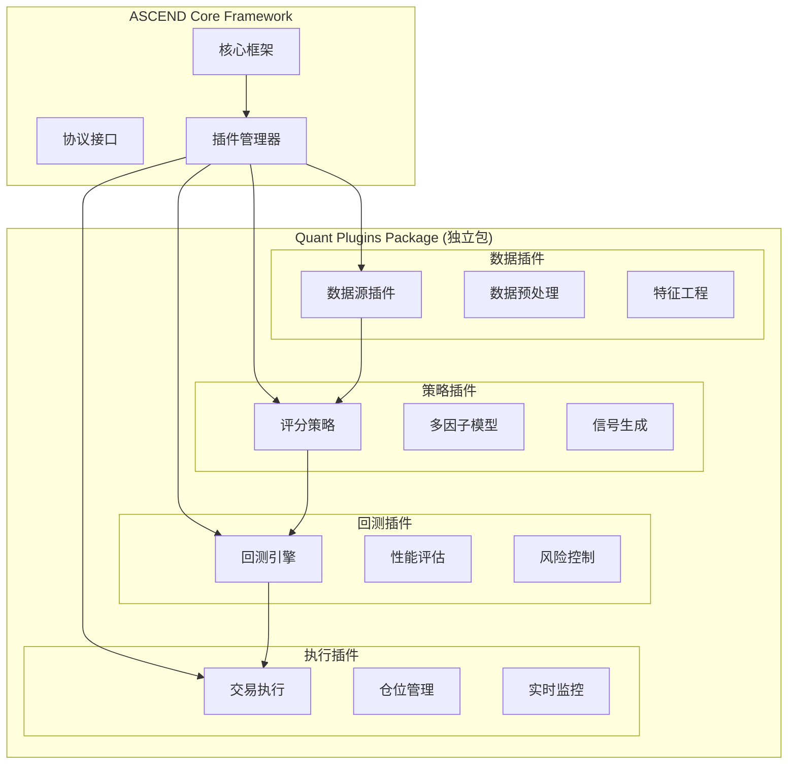
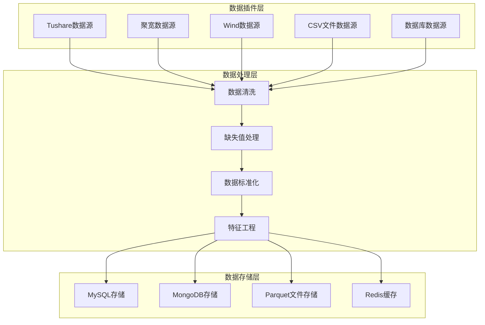
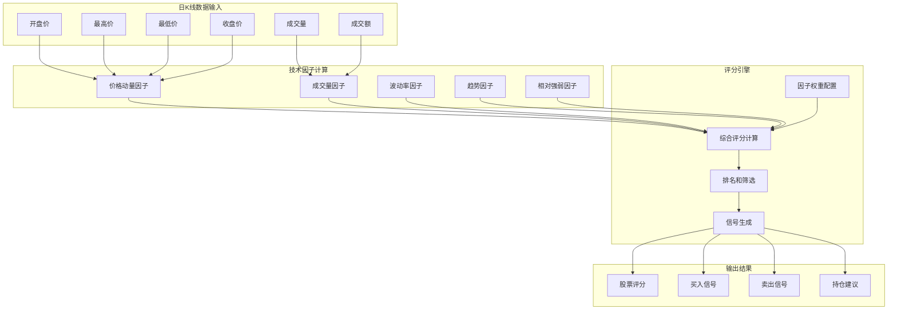
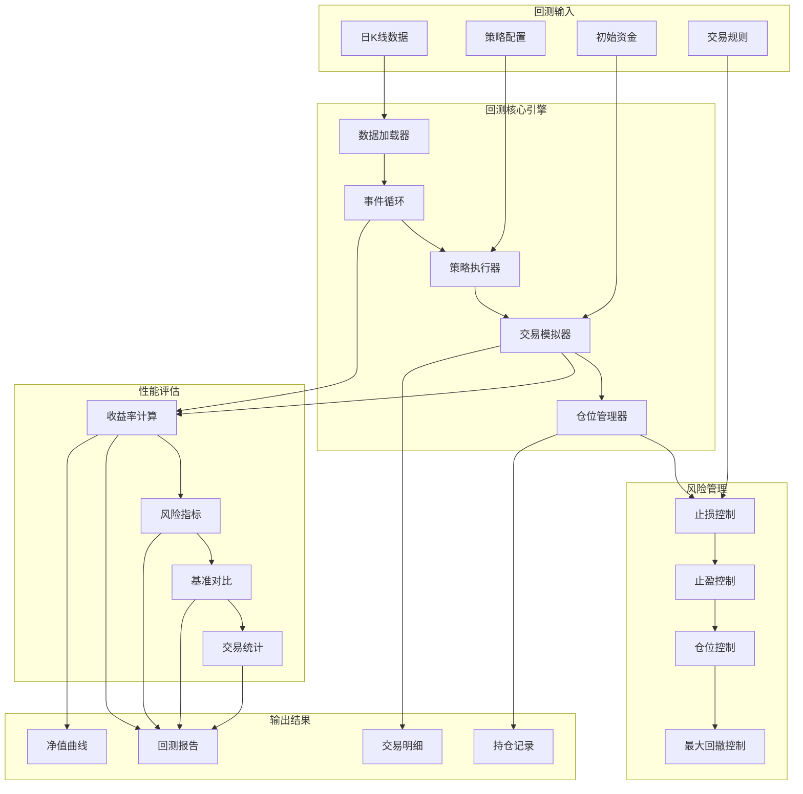
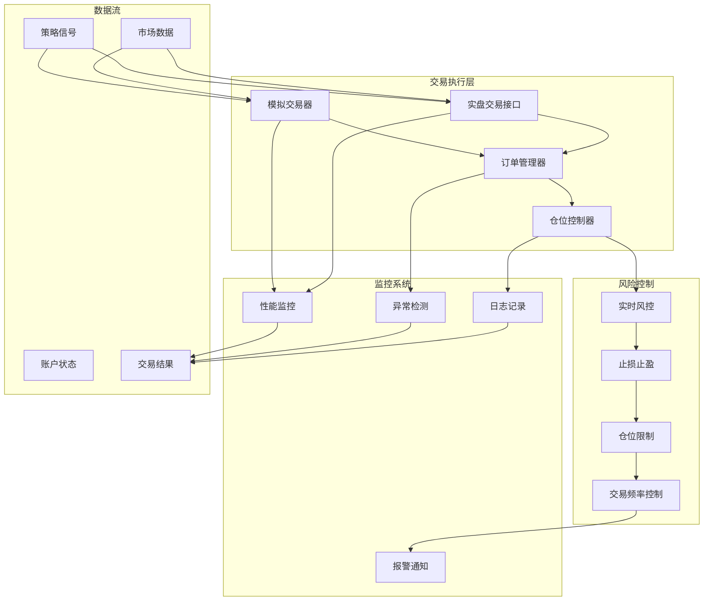

# 金融量化工具架构设计文档

## 🎯 项目概述

基于 ASCEND 框架构建的金融量化工具，专注于日K线策略，通过多因子评分模型对沪深创业板股票进行打分、回测和交易决策。

## 🏗️ 整体架构设计

### 插件化架构理念



### 模块划分

1. **数据层 (Data Layer)**
   - 数据源插件 (Tushare/聚宽/Wind)
   - 数据预处理插件
   - 数据存储插件 (MySQL/MongoDB)

2. **策略层 (Strategy Layer)**
   - 日K线评分策略插件
   - 多因子模型插件
   - 信号生成插件

3. **回测层 (Backtest Layer)**
   - 回测引擎插件
   - 性能评估插件
   - 风险控制插件

4. **执行层 (Execution Layer)**
   - 模拟交易器插件
   - 实时监控插件
   - 风险控制插件

## 🔌 核心插件设计

### 1. 数据插件架构 (`IFeatureExtractor` 协议)



**TushareDataPlugin**:
- 支持沪深创业板股票数据获取
- 日K线数据特征提取
- 自动数据更新和维护

**MySQLStoragePlugin**:
- 数据持久化存储
- 历史数据管理
- 快速数据查询

### 2. 日K线策略插件架构 (`IPolicy` 协议)



**DailyKlineScoringPlugin**:
- 多因子评分模型
- 日K线技术指标计算
- 动态权重配置

**评分因子**:
- 动量因子 (30%)
- 成交量因子 (20%)
- 波动率因子 (15%)
- 趋势因子 (20%)
- RSI相对强弱 (15%)

### 3. 回测引擎插件架构 (`IEnvironment` 协议)



**DailyBacktestEnginePlugin**:
- 基于事件驱动的回测框架
- 完整的交易模拟
- 详细的性能评估

**核心功能**:
- 初始资金配置
- 交易成本模拟
- 风险控制规则
- 性能指标计算

### 4. 交易执行和监控插件架构



**SimTraderPlugin**:
- 模拟交易执行
- 仓位管理
- 订单处理

**RealtimeMonitorPlugin** (`IMonitor` 协议):
- 实时性能监控
- 风险预警
- 系统状态检查

## 📊 数据流设计


## ⚙️ 配置文件设计

### 主配置文件结构

```yaml
version: "1.0.0"
framework: "ascend"

plugins:
  - "tushare_data"
  - "mysql_storage"
  - "daily_kline_scoring"
  - "daily_backtest_engine"
  - "sim_trader"
  - "realtime_monitor"

data:
  source: "tushare"
  start_date: "2023-01-01"
  end_date: "2023-12-31"
  symbols_file: "./config/symbols.txt"

strategy:
  type: "daily_kline_scoring"
  factor_weights:
    momentum: 0.35
    volume: 0.15
    volatility: 0.15
    trend: 0.25
    rsi_strength: 0.10
  scoring_threshold: 0.65

backtest:
  initial_capital: 1000000
  commission: 0.0003
  slippage: 0.0001
  max_position_per_stock: 0.2

execution:
  type: "simulation"
  trade_time: "14:55:00"
```

### 股票列表文件格式

```
# config/symbols.txt
000001.SZ  # 平安银行
000002.SZ  # 万科A
000063.SZ  # 中兴通讯
300001.SZ  # 特锐德
300002.SZ  # 神州泰岳
600000.SH  # 浦发银行
```

## 🚀 实施路线图

### Phase 1: 基础架构搭建
- [ ] 创建插件项目结构
- [ ] 实现数据插件
- [ ] 实现策略插件框架

### Phase 2: 核心功能开发
- [ ] 完成日K线评分策略
- [ ] 实现回测引擎
- [ ] 开发模拟交易器

### Phase 3: 系统集成
- [ ] 插件配置管理
- [ ] 数据流水线整合
- [ ] 性能监控系统

### Phase 4: 优化扩展
- [ ] 多策略支持
- [ ] 实时数据接入
- [ ] 高级风控功能

## 📈 性能指标

### 回测评估指标
- 总收益率
- 年化收益率
- 夏普比率
- 最大回撤
- 胜率
- 盈亏比

### 监控指标
- 系统运行状态
- 数据更新频率
- 策略执行性能
- 风险指标监控

## 🔧 技术栈

- **框架**: ASCEND (Python Protocol-based)
- **数据源**: Tushare API
- **数据库**: MySQL/MongoDB
- **分析库**: Pandas/Numpy
- **可视化**: Matplotlib/Plotly
- **监控**: 自定义监控系统

## 📋 开发规范

### 代码结构
```
quant_plugins/
├── __init__.py
├── data_plugins/
├── strategy_plugins/
├── backtest_plugins/
├── execution_plugins/
└── config/
```

### 插件开发规范
1. 遵循 ASCEND 协议接口
2. 独立的配置管理
3. 完善的错误处理
4. 详细的日志记录
5. 单元测试覆盖

## 🎯 优势特点

1. **完全插件化**: 不侵入核心框架，保持ASCEND纯净性
2. **协议驱动**: 基于Python Protocol，类型安全
3. **配置灵活**: YAML配置驱动，易于调整参数
4. **日K线专注**: 深度优化日线策略性能
5. **风险控制**: 多层次风控体系
6. **可扩展性**: 易于添加新数据源和策略

## 📝 后续计划

1. 支持更多数据源（聚宽、Wind等）
2. 增加机器学习因子
3. 实现实盘交易接口
4. 开发Web可视化界面
5. 支持多时间框架策略

这个设计完全基于ASCEND框架的插件化理念，所有功能都通过独立的插件实现，保持了框架的通用性和纯净性。